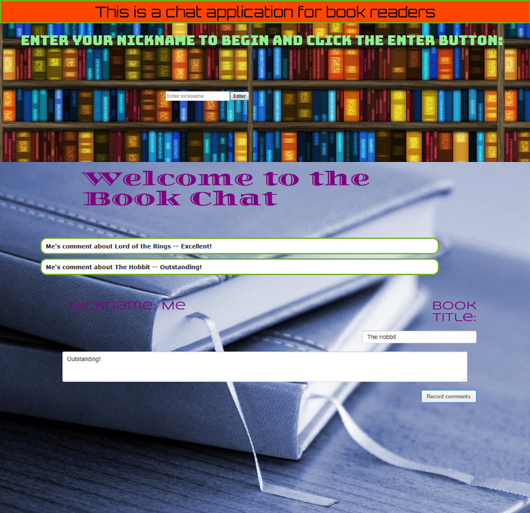

# chat
The purpose of this respository is to store code for a chat app, written in React.

The chat app is for a book discussion.

User needs to input a user name, the title of a book, and comments about the book.

Image shows the entry page, then the chat page.  

